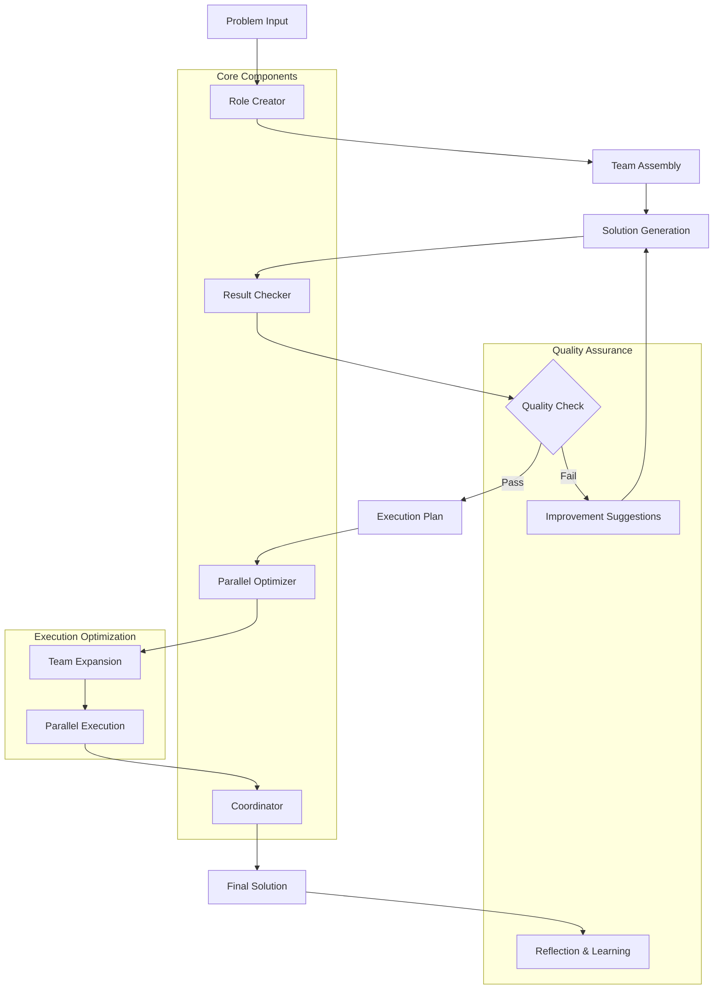

# 🚀 Problem Solving MCP Server

**Multi-Role Collaborative Problem Solving Framework Based on Model Context Protocol**

[](https://opensource.org/licenses/MIT)
[](https://nodejs.org/)
[](https://www.typescriptlang.org/)

## 📖 Documentation Navigation

| Document | Description | Language |
|----------|-------------|----------|
| [README.md](../zh/README.md) | Complete project documentation | 中文 |
| [README.md](README.md) | Complete project documentation | English |
| [INSTALLATION.md](INSTALLATION.md) | Installation and configuration guide | English |
| [QUICK_START.md](QUICK_START.md) | Quick start guide (5 minutes) | English |
| [example-usage.md](examples/example-usage.md) | Detailed usage examples | English |

## 🌟 Overview

This is an intelligent problem-solving MCP server that creates **3-12 professional roles** based on problem complexity, uses the **Eisenhower Matrix** for priority management, and implements **parallel processing optimization** to generate comprehensive, executable, and efficient solutions.

### ✨ Core Features

- 🎭 **Intelligent Team Configuration**: Automatically recommend 3-12 member teams based on problem complexity
- 🔍 **Multi-dimensional Quality Assurance**: Comprehensive checks on completeness, feasibility, quality, risk, and timeline
- ⚡ **Parallel Processing Optimization**: Automatically detect repetitive tasks and expand teams (up to 30 members)
- 📊 **Eisenhower Matrix Analysis**: Important-urgent quadrant analysis for priority management
- 🤝 **Multi-role Collaboration**: 12 professional role types for comprehensive problem solving
- 💡 **Reflection and Improvement**: Built-in reflection mechanism for continuous optimization

## 🛠️ Quick Configuration

### In Cursor
```json
{
  "mcpServers": {
    "problem-solving": {
      "command": "node",
      "args": ["/path/to/problem-solving-mcp/dist/index.js"],
      "cwd": "/path/to/problem-solving-mcp",
      "env": {
        "NODE_ENV": "production"
      }
    }
  }
}
```

### In Claude Desktop
```json
{
  "mcpServers": {
    "problem-solving": {
      "command": "node", 
      "args": ["/path/to/problem-solving-mcp/dist/index.js"],
      "cwd": "/path/to/problem-solving-mcp",
      "env": {
        "NODE_ENV": "production"
      }
    }
  }
}
```

> **Note**: Replace `/path/to/problem-solving-mcp` with your actual project path

## 🎯 API Documentation

### Core Tools (4)
| Tool | Description | Parameters |
|------|-------------|------------|
| `create_problem` | Create problem definition | title, description, domain, complexity_score |
| `solve_problem` | Intelligent problem solving (core function) | problem_id |
| `get_role_recommendations` | Get role configuration suggestions | problem_id |
| `check_solution` | Check solution quality | problem_id |

### Management Tools (4)
| Tool | Description | Parameters |
|------|-------------|------------|
| `get_problem_history` | View problem history | - |
| `get_team_status` | View team status | problem_id |
| `update_team_member` | Update team member | problem_id, role_id, updates |
| `assign_task` | Assign tasks | problem_id, task, assigned_to, priority |

### Analysis Tools (4)
| Tool | Description | Parameters |
|------|-------------|------------|
| `eisenhower_matrix_analysis` | Important-urgent quadrant analysis | problem_id |
| `analyze_task_dependencies` | Task dependency analysis | problem_id |
| `optimize_parallel_execution` | Parallel execution optimization | problem_id |
| `get_execution_report` | Get execution report | problem_id |

### Reflection Tools (3)
| Tool | Description | Parameters |
|------|-------------|------------|
| `create_reflection` | Create reflection record | problem_id, phase, insights, lessons_learned |
| `get_reflection_summary` | Get reflection summary | problem_id |
| `improve_solution` | Improve solution | problem_id, feedback |

## 🏗️ System Architecture



## 🎭 Core Components

### 1. Role Creator (`role-creator.ts`)
- **Function**: Intelligently create professional teams based on problem characteristics
- **Team Size**: 3-12 members (expandable to 30 for parallel processing)
- **Role Types**: 12 professional roles including analyst, researcher, designer, developer, etc.
- **Smart Matching**: Select core and supporting roles based on problem domain and complexity

### 2. Result Checker (`result-checker.ts`)
- **Multi-dimensional Assessment**: Completeness, feasibility, quality, risk, timeline
- **Problem Identification**: Classify issues by severity (low, medium, high, critical)
- **Improvement Suggestions**: Generate specific, actionable recommendations
- **Scoring System**: Comprehensive scoring (0-100) with approval decisions

### 3. Coordinator (`coordinator.ts`)
- **Process Management**: Complete problem-solving workflow orchestration
- **Task Dependencies**: Manage task relationships and parallel execution
- **Progress Tracking**: Real-time monitoring of solution progress
- **Quality Control**: Multi-round improvement and iteration support

### 4. Parallel Optimizer (`parallel-optimizer.ts`)
- **Task Analysis**: Evaluate task repetitiveness and workload
- **Team Expansion**: Intelligent scaling based on workload analysis
- **Role Subdivision**: Single-function multi-role parallel processing
- **Efficiency Target**: 2.5x performance improvement goal

## 🚀 Best Practices

### Problem Definition
```javascript
// Good example
{
  title: "Develop AI Customer Service System",
  description: "Develop intelligent customer service system for e-commerce platform, supporting multi-turn dialogue, sentiment analysis, and automatic replies",
  domain: "software_development", 
  complexity_score: 8
}
```

### Team Configuration
- **Simple Problems (1-3)**: 3-5 members, core roles
- **Medium Problems (4-6)**: 6-8 members, core + supporting roles
- **Complex Problems (7-10)**: 9-12 members, full professional team

### Priority Management
Use Eisenhower Matrix for task prioritization:
- **Urgent & Important**: Immediate action
- **Important & Not Urgent**: Planned execution
- **Urgent & Not Important**: Delegate or automate
- **Not Urgent & Not Important**: Eliminate or postpone

## ⚙️ Configuration and Extension

### Environment Variables
```bash
NODE_ENV=production          # Production mode
DEBUG_MODE=false            # Debug mode
MAX_TEAM_SIZE=30           # Maximum team size
PARALLEL_THRESHOLD=0.7     # Parallel processing threshold
```

### Custom Role Types
```typescript
// Extend role types in types.ts
export enum RoleType {
  // ... existing roles
  custom_specialist = 'custom_specialist'
}
```

## 📊 Performance Metrics

### Efficiency Improvements
- **Team Expansion**: Up to 30 members for complex tasks
- **Parallel Processing**: 2.5x efficiency improvement target
- **Quality Assurance**: Multi-dimensional scoring system
- **Iteration Optimization**: Reflection-based continuous improvement

### Resource Allocation
- **Capability-based**: Workload distribution based on role capabilities
- **Conflict Avoidance**: Prevent resource conflicts
- **Dynamic Load Balancing**: Real-time workload adjustment

## 🧪 Testing and Debugging

### Development Mode
```bash
npm run dev
```

### Debug Logging
```bash
NODE_ENV=development npm start
```

### Test Commands
```bash
# Basic functionality test
npm test

# Integration test
npm run test:integration

# Performance test
npm run test:performance
```

## 🚀 Deployment and Operations

### Production Deployment
```bash
# Build project
npm run build

# Start service
npm start

# Process management (PM2)
pm2 start dist/index.js --name problem-solving-mcp
```

### Monitoring
- **Health Checks**: Service status monitoring
- **Performance Metrics**: Response time, success rate tracking
- **Error Logging**: Comprehensive error logging and alerting

### Scaling
- **Horizontal Scaling**: Multiple service instances
- **Load Balancing**: Request distribution
- **Resource Monitoring**: CPU, memory usage tracking

## 🤝 Community and Support

### Getting Help
- 📧 Email: your-email@example.com
- 🐛 Issue Reporting: [GitHub Issues](https://github.com/your-repo/issues)
- 📖 Documentation: [Wiki](https://github.com/your-repo/wiki)
- 💬 Community: [Discord](https://discord.gg/your-server)

### Contributing
- 🔧 Code Contributions: Follow our [Contributing Guide](CONTRIBUTING.md)
- 📝 Documentation: Help improve documentation
- 🐛 Bug Reports: Report issues with detailed information
- 💡 Feature Requests: Suggest new features

## 🗺️ Roadmap

### Version 1.1 - Infrastructure & UI
- [ ] Persistent storage support (PostgreSQL, MongoDB)
- [ ] Web dashboard interface
- [ ] RESTful API endpoints
- [ ] Role template marketplace

### Version 1.2 - AI Enhancement
- [ ] **Prompt Engineering Optimization** - Automatic role construction instead of template dependency
- [ ] Machine learning-based role recommendations
- [ ] Advanced parallel processing algorithms
- [ ] Integration with external project management tools
- [ ] Multi-language support expansion

### Version 2.0 - Enterprise & Collaboration
- [ ] Distributed processing architecture
- [ ] Real-time collaboration features
- [ ] Advanced analytics and reporting
- [ ] Enterprise-grade security features

## 🎯 Next Major Focus: Prompt Engineering Optimization

### 🧠 Dynamic Role Construction
The next major enhancement will focus on **intelligent role creation through prompt engineering** rather than relying on static templates:

#### Current State (Template-based)
- Fixed role templates with predefined skills and responsibilities
- Limited adaptability to unique problem contexts
- Manual role customization required for edge cases

#### Target State (AI-driven)
- **Dynamic Role Generation**: AI analyzes problem context and automatically constructs optimal roles
- **Contextual Skill Mapping**: Skills and responsibilities dynamically matched to specific problem requirements
- **Adaptive Role Evolution**: Roles can evolve and specialize during project execution
- **Cross-domain Intelligence**: Automatic role synthesis from multiple domain expertise

#### Implementation Strategy
1. **Prompt Engineering Framework**
   - Develop sophisticated prompts for role analysis and construction
   - Create role synthesis algorithms based on problem characteristics
   - Implement dynamic skill assessment and matching

2. **Context-Aware Role Creation**
   - Analyze problem domain, complexity, and constraints
   - Generate custom role specifications in real-time
   - Optimize team composition for specific project needs

3. **Intelligent Role Specialization**
   - Enable roles to develop specialized capabilities during execution
   - Implement learning mechanisms for role improvement
   - Support role subdivision and evolution based on workload

4. **Quality Assurance for AI Roles**
   - Validate generated roles against problem requirements
   - Ensure role coherence and non-redundancy
   - Implement feedback loops for role optimization

## 📄 License

MIT License - see [LICENSE](LICENSE) file for details

---

🎉 **Congratulations! Your Problem Solving MCP Server is ready!**

Start enjoying the power of intelligent problem solving! 🚀✨ 