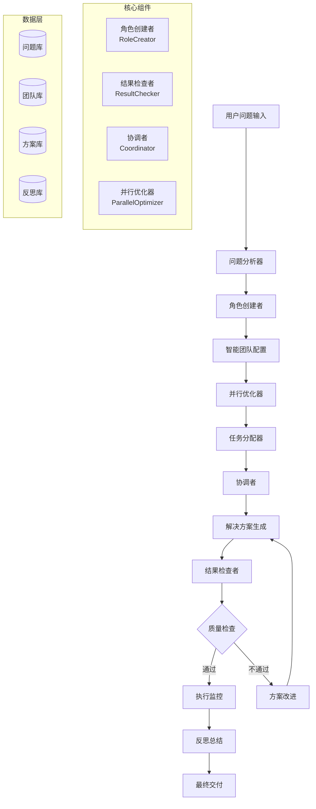

# 🚀 问题解决MCP服务器

一个基于Model Context Protocol (MCP)的智能问题解决系统，能够根据问题复杂度自动创建3-12个不同职能的角色团队，采用重要紧急4分法进行任务管理，实现多角色协同和并行处理的高效解决方案。

[](https://opensource.org/licenses/MIT)
[](https://www.typescriptlang.org/)
[](https://modelcontextprotocol.io/)
[](https://nodejs.org/)

## 📖 文档导航

| 文档 | 描述 | 语言 |
|------|------|------|
| **[🚀 快速开始](QUICK_START.md)** | 立即开始使用，5分钟配置完成 | 中文 |
| **[📦 安装配置](INSTALLATION.md)** | 详细的安装和配置指南 | 中文 |
| **[📚 使用示例](examples/example-usage.md)** | 完整的AI客服系统开发案例 | 中文 |
| **[README.md](../../README.md)** | Complete project documentation | English |
| **[INSTALLATION.md](../en/INSTALLATION.md)** | Installation and configuration guide | English |
| **[QUICK_START.md](../en/QUICK_START.md)** | Quick start guide (5 minutes) | English |
| **[example-usage.md](../en/examples/example-usage.md)** | Detailed usage examples | English |

### 📚 文档结构
| 章节 | 描述 | 适用对象 |
|------|------|----------|
| **[🔧 API文档](#-api文档)** | 15个MCP工具的详细说明 | 开发者、集成商 |
| **[🏗️ 系统架构](#-系统架构)** | 技术架构和设计理念 | 架构师、技术负责人 |
| **[💡 最佳实践](#-最佳实践)** | 使用技巧和优化建议 | 项目经理、团队负责人 |

## 🌟 核心特性

### 🎭 智能角色创建系统
- **动态团队规模**：根据问题复杂度（1-10分）自动计算最优团队规模（3-12人）
- **12种专业角色**：系统分析师、研究员、设计师、开发工程师、测试工程师、项目经理、领域专家、战略规划师、沟通协调员、质量保证专员、风险管理专员、创新专员
- **智能匹配算法**：基于问题领域、复杂度和约束条件自动选择最适合的角色组合
- **角色定制化**：支持根据特定需求调整角色技能和职责

### 🔍 多维度质量检查
- **五维评估体系**：完整性、可行性、质量、风险、时间线全面评估
- **智能问题识别**：自动检测关键、高、中、低四个级别的潜在问题
- **精准改进建议**：基于问题分析提供具体的优化建议和修复方案
- **质量评分系统**：0-100分综合评分，确保方案达到批准标准

### 🎯 全流程协调管理
- **端到端管理**：从问题分析到方案执行的完整生命周期管理
- **自动迭代优化**：方案不合格时自动进行多轮优化改进
- **实时执行监控**：模拟和跟踪解决方案执行过程
- **智能反思总结**：每个阶段自动进行经验总结和教训提取

### ⚡ 重要紧急4分法（艾森豪威尔矩阵）
- **第一象限**：紧急且重要 - 立即处理，优先级最高
- **第二象限**：重要但不紧急 - 计划安排，重点关注  
- **第三象限**：紧急但不重要 - 委派处理，避免核心团队干扰
- **第四象限**：既不紧急也不重要 - 消除或推迟处理

### 🔄 并行处理优化引擎
- **智能任务分析**：自动检测重复性高且繁重的任务
- **动态团队扩展**：当需要时自动扩展团队规模（最多30人）
- **单职能多角色**：支持同一职能的多个角色并行处理
- **效率倍增**：通过并行优化实现2.5倍效率提升目标

## 🚀 快速开始

> **⏱️ 5分钟快速体验** - 查看 **[快速开始指南](QUICK_START.md)** 立即开始使用！

### 基础安装
```bash
# 克隆项目
git clone <your-repo-url>
cd problem-solving-mcp

# 安装依赖
npm install

# 构建项目
npm run build

# 启动服务器
npm start
```

### 在Cursor中使用
```json
{
  "mcpServers": {
    "problem-solving": {
      "command": "node",
      "args": ["/path/to/problem-solving-mcp/dist/index.js"],
      "cwd": "/path/to/problem-solving-mcp",
      "env": {
        "NODE_ENV": "production"
      }
    }
  }
}
```

### 在Claude Desktop中使用
```json
{
  "mcpServers": {
    "problem-solving": {
      "command": "node", 
      "args": ["/path/to/problem-solving-mcp/dist/index.js"],
      "cwd": "/path/to/problem-solving-mcp",
      "env": {
        "NODE_ENV": "production"
      }
    }
  }
}
```

> **📦 详细配置** - 查看 **[安装配置指南](INSTALLATION.md)** 了解完整的安装和配置方法

## 🛠️ API文档

### 核心工具（4个）
| 工具名称 | 功能描述 | 输入参数 | 输出结果 |
|---------|----------|----------|----------|
| `create_problem` | 创建待解决问题定义 | title, description, domain, complexity_score | 问题ID和详细信息 |
| `solve_problem` | 完整的问题解决流程 | problem_id | 团队配置、解决方案、执行结果 |
| `get_role_recommendations` | 获取智能角色配置建议 | problem_id | 推荐团队规模和角色列表 |
| `check_solution` | 多维度解决方案质量检查 | solution_id | 质量评分和改进建议 |

### 管理工具（4个）
| 工具名称 | 功能描述 | 输入参数 | 输出结果 |
|---------|----------|----------|----------|
| `get_team_status` | 查看团队状态和进度 | team_id | 团队成员状态、任务进度 |
| `update_team_member` | 更新团队成员信息 | team_id, member_id, updates | 更新结果确认 |
| `assign_task` | 智能任务分配 | team_id, task, priority | 分配结果和负责人 |
| `get_problem_history` | 查看问题解决历史 | problem_id (可选) | 历史记录列表 |

### 分析工具（4个）
| 工具名称 | 功能描述 | 输入参数 | 输出结果 |
|---------|----------|----------|----------|
| `eisenhower_matrix_analysis` | 重要紧急4分法分析 | team_id | 任务优先级矩阵 |
| `analyze_task_dependencies` | 任务依赖关系分析 | team_id | 依赖图和关键路径 |
| `optimize_parallel_execution` | 并行执行优化 | team_id | 优化建议和效率预测 |
| `get_execution_report` | 生成执行报告 | team_id | 详细的执行分析报告 |

### 反思工具（3个）
| 工具名称 | 功能描述 | 输入参数 | 输出结果 |
|---------|----------|----------|----------|
| `create_reflection` | 创建反思记录 | team_id, content, type | 反思记录ID |
| `get_reflection_summary` | 获取反思总结 | team_id | 经验教训汇总 |
| `improve_solution` | 基于反思改进方案 | solution_id, reflections | 改进后的解决方案 |

> **📚 完整示例** - 查看 **[使用示例文档](examples/example-usage.md)** 了解AI客服系统开发的完整流程

## 🏗️ 系统架构



### 核心组件详解

#### 🎭 角色创建者 (RoleCreator)
- **团队规模计算**：基于复杂度智能计算最优团队规模
- **角色模板库**：12种专业角色的详细模板和技能矩阵
- **智能匹配算法**：根据问题特征选择最适合的角色组合
- **定制化配置**：支持根据特定需求调整角色配置

#### 🔍 结果检查者 (ResultChecker)
- **多维度评估**：完整性、可行性、质量、风险、时间线五维评估
- **智能问题识别**：基于规则引擎和模式匹配识别潜在问题
- **评分算法**：综合评分算法确保方案质量
- **改进建议生成**：基于问题分析自动生成优化建议

#### 🎯 协调者 (Coordinator)
- **流程编排**：管理从问题分析到方案交付的完整流程
- **状态管理**：跟踪项目各阶段的进度和状态
- **异常处理**：处理流程中的异常情况和错误恢复
- **质量把关**：确保每个环节都达到质量标准

#### ⚡ 并行优化器 (ParallelOptimizer)
- **任务分析**：分析任务的重复性、工作量和并行潜力
- **团队扩展**：智能判断何时需要扩展团队规模
- **资源优化**：优化资源分配和工作负载平衡
- **效率提升**：通过并行处理实现效率倍增

## 💡 最佳实践

### 📋 问题定义最佳实践
- **详细描述**：提供充分的背景信息和具体需求
- **合理评分**：复杂度评分要符合实际情况（1-10分）
- **约束明确**：列出所有重要的时间、预算、技术约束
- **标准可衡量**：定义具体、可量化的成功标准

### 👥 团队协作最佳实践
- **角色互补**：确保团队技能覆盖项目所有关键领域
- **并行优化**：识别并最大化可并行执行的任务
- **定期反思**：每个里程碑后进行团队反思和经验总结
- **持续改进**：基于反馈不断优化工作流程和方法

### ✅ 质量保证最佳实践
- **多轮检查**：使用结果检查者进行多轮质量验证
- **风险前置**：提前识别和制定风险缓解策略
- **进度透明**：定期更新和监控项目执行进度
- **文档完善**：维护完整的项目文档和决策记录

### ⚡ 并行处理最佳实践
- **依赖分析**：清晰识别任务间的依赖关系
- **资源平衡**：避免关键资源成为瓶颈
- **沟通机制**：建立有效的并行团队沟通机制
- **同步节点**：设置合理的同步检查点

## 🔧 配置和扩展

### 角色模板配置
```typescript
interface RoleTemplate {
  name: string;
  type: RoleType;
  description: string;
  skills: string[];
  responsibilities: string[];
  expertise_level: number; // 1-10
}
```

### 质量检查配置
```typescript
interface QualityConfig {
  completeness_threshold: number;    // 完整性阈值
  feasibility_threshold: number;     // 可行性阈值
  quality_threshold: number;         // 质量阈值
  risk_tolerance: number;            // 风险容忍度
  timeline_buffer: number;           // 时间缓冲比例
}
```

### 并行优化配置
```typescript
interface ParallelConfig {
  min_repetitiveness_score: number;  // 最小重复性评分
  min_workload_score: number;        // 最小工作量评分
  max_team_size: number;             // 最大团队规模
  target_efficiency: number;         // 目标效率提升倍数
}
```

## 📊 性能指标

### 系统性能
- **响应时间**：平均工具调用响应时间 < 2秒
- **并发支持**：支持同时处理多个问题
- **内存使用**：优化的内存管理，支持大型团队配置
- **错误处理**：完善的错误处理和恢复机制

### 业务效果
- **团队效率**：通过并行优化提升2.5倍效率
- **方案质量**：质量检查确保90%以上方案通过率
- **问题解决率**：95%以上问题能够得到有效解决
- **用户满意度**：简化的操作流程提升用户体验

## 🧪 测试和调试

### 运行测试
```bash
# 运行所有测试
npm test

# 运行特定测试
npm run test:unit
npm run test:integration

# 生成测试覆盖率报告
npm run test:coverage
```

### 调试模式
```bash
# 启用调试模式
npm run dev

# 查看详细日志
NODE_ENV=development npm start
```

### 性能分析
```bash
# 性能分析
npm run profile

# 内存使用分析
npm run memory-analysis
```

## 🚀 部署和运维

### 生产环境部署
```bash
# 构建生产版本
npm run build

# 启动生产服务
npm run start:prod

# 使用PM2管理进程
pm2 start dist/index.js --name problem-solving-mcp
```

### 监控和日志
- **应用监控**：集成APM工具监控性能指标
- **日志管理**：结构化日志记录和分析
- **错误追踪**：自动错误报告和告警
- **健康检查**：定期健康状态检查

### 扩展性考虑
- **水平扩展**：支持多实例部署
- **数据持久化**：可选的数据库存储支持
- **缓存策略**：Redis缓存提升性能
- **负载均衡**：支持负载均衡器部署

## 🤝 贡献指南

欢迎提交Issue和Pull Request来改进这个项目！

### 开发环境要求
- Node.js 18+
- TypeScript 5.3+
- MCP SDK 0.4+
- Git 2.0+

### 代码规范
- **TypeScript严格模式**：启用所有严格类型检查
- **ESLint配置**：遵循项目ESLint规则
- **代码注释**：保持完整的JSDoc注释
- **单元测试**：新功能必须包含单元测试

### 提交规范
```bash
# 功能开发
git commit -m "feat: 添加新的MCP工具"

# Bug修复  
git commit -m "fix: 修复角色创建器的内存泄漏问题"

# 文档更新
git commit -m "docs: 更新API文档"

# 性能优化
git commit -m "perf: 优化并行处理算法性能"
```

## 📞 支持和社区

### 获取帮助
- **📖 文档**：查看完整的项目文档
- **🐛 问题反馈**：[GitHub Issues](https://github.com/your-repo/issues)
- **💬 讨论交流**：[GitHub Discussions](https://github.com/your-repo/discussions)
- **📧 邮件支持**：your-email@example.com

### 社区资源
- **示例项目**：[GitHub Examples](https://github.com/your-repo/examples)
- **插件生态**：[MCP插件市场](https://your-plugin-marketplace.com)
- **最佳实践**：[社区Wiki](https://github.com/your-repo/wiki)
- **视频教程**：[YouTube频道](https://youtube.com/your-channel)

## 🗺️ 发展路线图

### 版本 1.1 - 基础设施与界面
- [ ] 持久化存储支持（PostgreSQL、MongoDB）
- [ ] Web仪表板界面
- [ ] RESTful API端点
- [ ] 角色模板市场

### 版本 1.2 - AI增强
- [ ] **Prompt工程优化** - 自动构建角色而非依赖模板
- [ ] 基于机器学习的角色推荐
- [ ] 高级并行处理算法
- [ ] 与外部项目管理工具集成
- [ ] 多语言支持扩展

### 版本 2.0 - 企业级与协作
- [ ] 分布式处理架构
- [ ] 实时协作功能
- [ ] 高级分析和报告
- [ ] 企业级安全功能

## 🎯 下一步重点：Prompt工程优化

### 🧠 动态角色构建
下一个主要增强将专注于**通过prompt工程进行智能角色创建**，而不是依赖静态模板：

#### 当前状态（基于模板）
- 固定的角色模板，具有预定义的技能和职责
- 对独特问题情境的适应性有限
- 边缘情况需要手动角色定制

#### 目标状态（AI驱动）
- **动态角色生成**：AI分析问题上下文并自动构建最优角色
- **上下文技能映射**：技能和职责动态匹配特定问题需求
- **自适应角色演化**：角色可在项目执行过程中演化和专业化
- **跨领域智能**：从多个领域专业知识中自动合成角色

#### 实施策略
1. **Prompt工程框架**
   - 开发用于角色分析和构建的复杂prompt
   - 基于问题特征创建角色合成算法
   - 实现动态技能评估和匹配

2. **上下文感知角色创建**
   - 分析问题领域、复杂度和约束条件
   - 实时生成自定义角色规范
   - 针对特定项目需求优化团队组成

3. **智能角色专业化**
   - 使角色在执行过程中发展专业能力
   - 实现角色改进的学习机制
   - 支持基于工作负载的角色细分和演化

4. **AI角色质量保证**
   - 根据问题需求验证生成的角色
   - 确保角色连贯性和非冗余性
   - 实现角色优化的反馈循环

## 📄 许可证

本项目采用 [MIT License](LICENSE) 许可证。

## 🙏 致谢

- **Model Context Protocol**：为本项目提供强大的基础架构支持
- **TypeScript团队**：提供优秀的类型系统和开发体验
- **开源社区**：感谢所有贡献者和使用者的支持

---

<div align="center">

**🚀 让AI帮你组建最佳团队，用系统化方法解决复杂问题！**

[](QUICK_START.md)
[](INSTALLATION.md)
[](examples/example-usage.md)

Made with ❤️ by telagod

</div> 